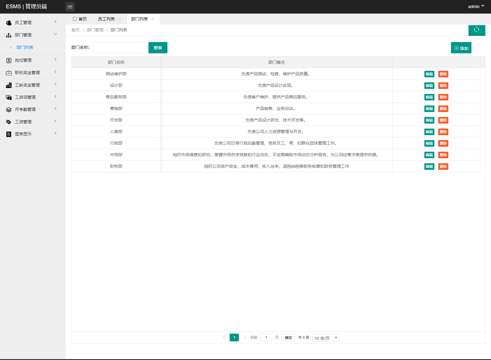
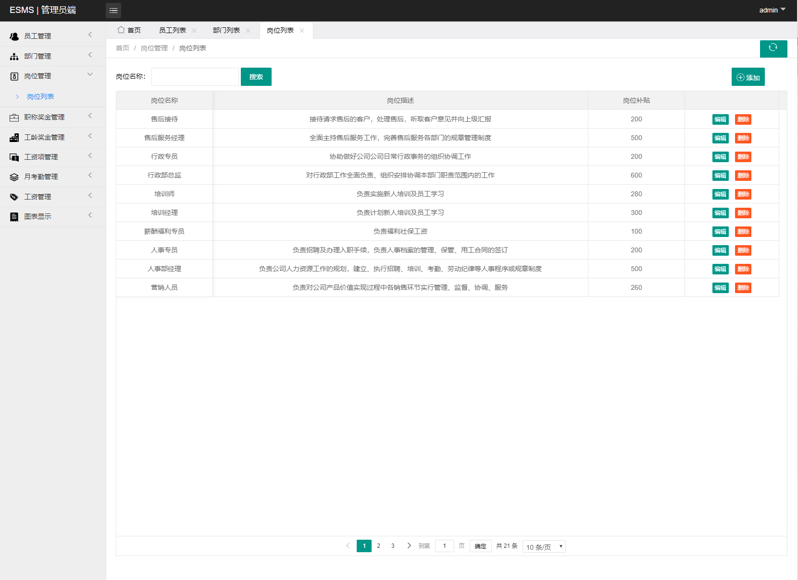
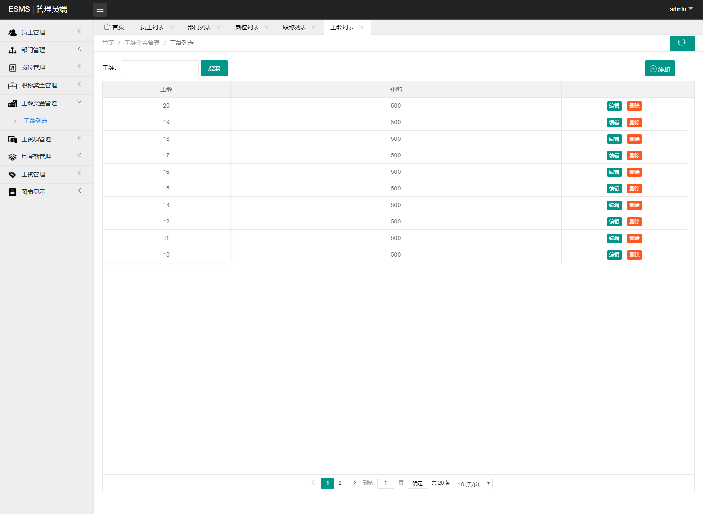
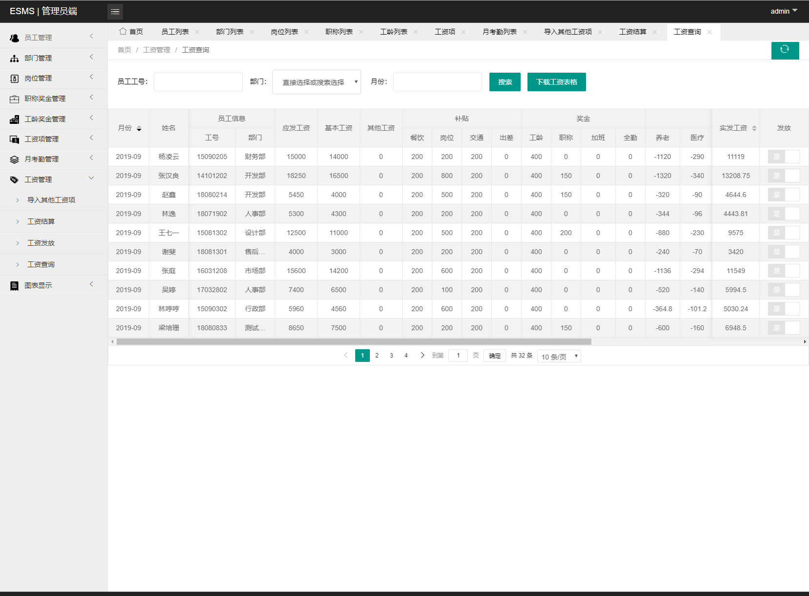
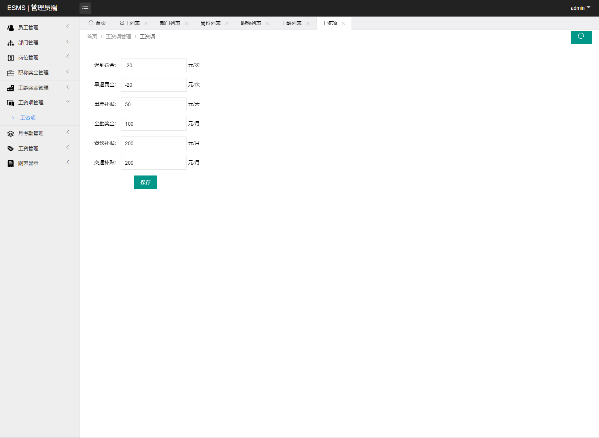
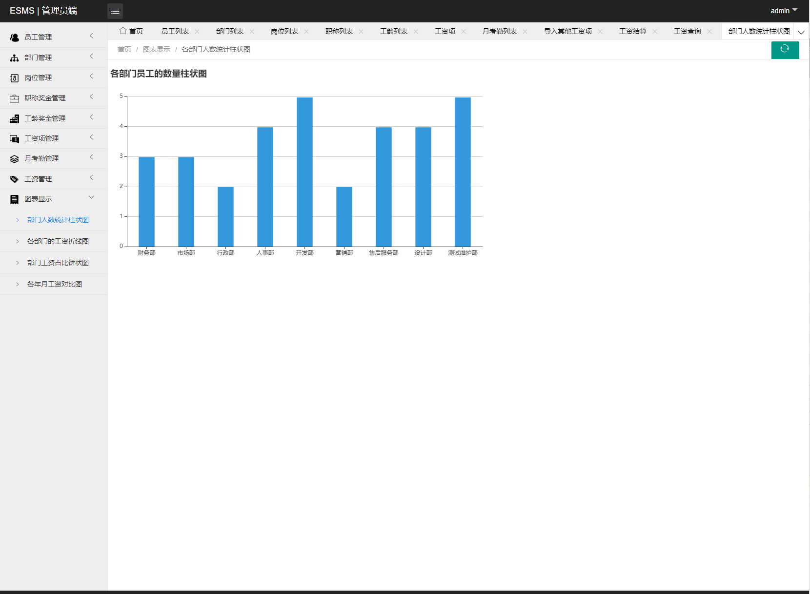
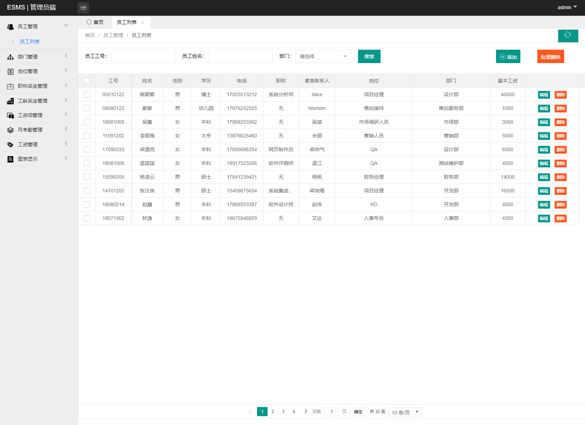
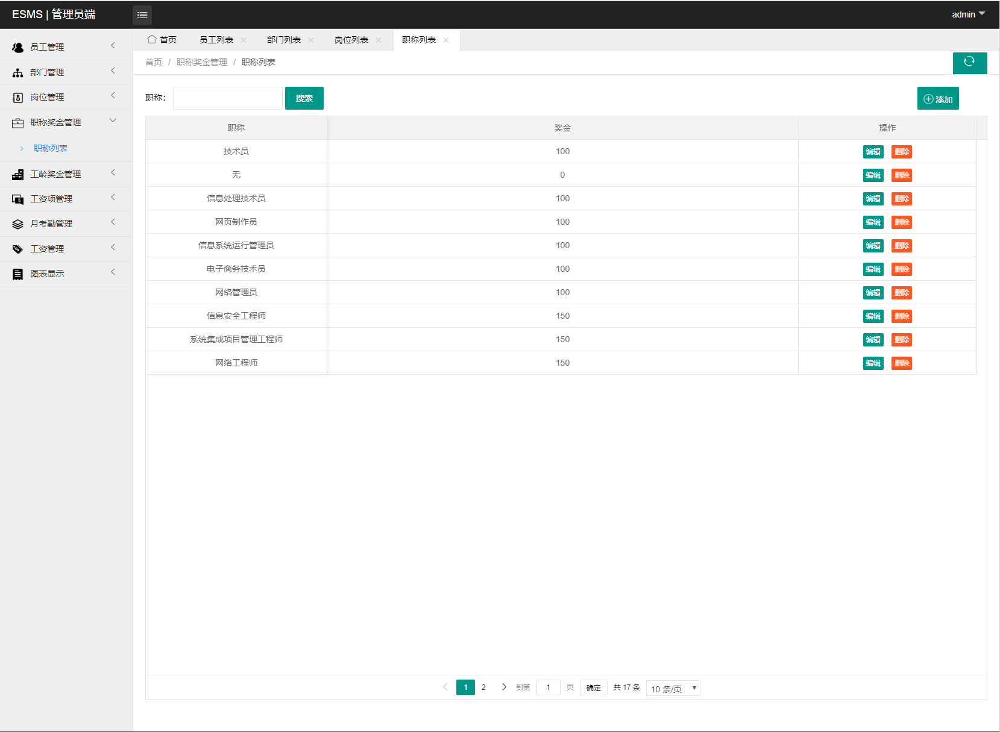

## 基于SSM框架的企业工资管理系统

###  获取sql数据库文件: 从戎源码网 (https://armycodes.com/) QQ: 386869957 QQ群: 377586148
###  所有系统地址: (https://github.com/YuLin-Coder/AllProjectCatalog) 
###  所有项目以及源代码本人均调试运行无问题 可支持远程安装部署调试、定制修改、代码讲解

## 项目介绍
基于SSM框架的企业工资管理系统，系统包含员工和管理员两种角色：,系统有只有后台模块，主要功能如下。

员工角色：
个人信息管理、考勤管理、工资管理

管理员角色：
员工管理、部门管理、岗位管理、职位奖金管理、工资奖金管理、月考勤管理、工资管理、图表管理

## 项目技术
- 编程语言：Java
- 数据库：MySQL
- 前端技术：HTML+Bootstrap+Layui+bootstrap+ECharts
- 后端技术：Spring、SpringMVC、MyBatis

## 运行环境
- JDK版本：JDK1.8及以上
- 开发工具：IDEA、Ecplise、Myecplise都可以
- 数据库: MySQL5.7及以上

## 运行截图

